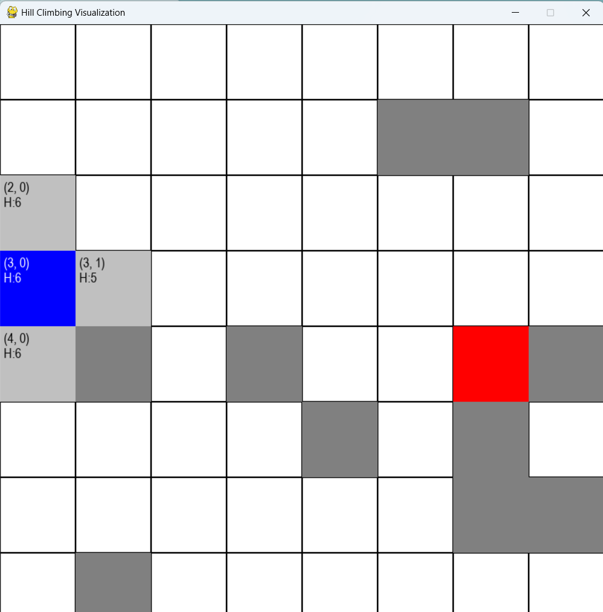

<h1>Using Chebyshev Distance,hill climb, random positon start,goal and barriers</h1>
<h2>can switch next step and previous step by arrow button</h2>
<h3>Random positon when neighbors have the same value</h3>

